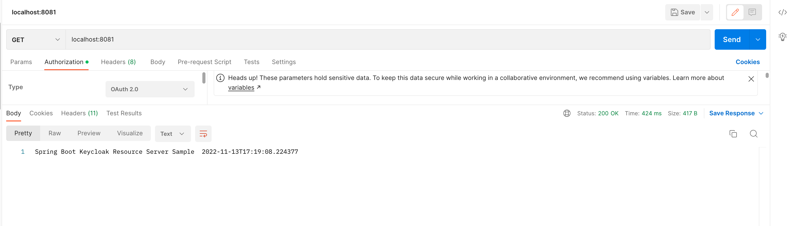

# spring-boot-keycloak-resource-server

### How to protect your Spring Boot microservice with OAuth2?

### How to set up KeyCloak for OAuth2 client credentials flow?

We live in the age of microservices.

Microservices are often deployed as REST APIs.

And the most popular way to protect and access these REST APIs is through OAuth2 protocol.

And in OAuth2 protocol ,the preferred way to protect REST APIs is through client credentials.

To set this,

You first need an Identity and Access Management provider or in OAuth2 terms ,an authorization server.

KeyCloak is one such authorization server.

This post explains how to set up a KeyCloak server for client credentials flow in OAuth2.

Once the set up is done you will be able to protect your REST APIs / microservices using OAuth2(these are called
resource servers in OAuth2)

And also you will be able to access OAuth2 protected resources using client credentials from other microservices (these
are called clients in OAuth2 terms).

Below is the algorithm to set up client credentials flow in KeyCloak:

**STEP 1**: Download KeyCloak

You can download keycloak from [here](https://www.keycloak.org/)

**STEP 2**: Run KeyCloak
To run keycloak first unzip the folder downloaded in step 1.

Go to bin folder and run the command:

MacOs / Linux

```shell
bin/kc.sh start-dev
```

Windows

```shell
bin/kc.bat start-dev
```

This will start keycloak server at port 8080.

Launch http://localhost:8080


Your keycloak server is up and running now.

**STEP 3**: Create an admin user
To create an admin user , enter username ,password and password confirmation in the home page

This will create an admin user.

Then click on “Administration Console” link.

A login page will be displayed:


Login using your admin credentials.

**STEP 4**: Create a realm
Once logged in as admin ,create a realm. This is a top level organization method followed by most IAM(Identity and
Access Management) providers.

You can create a new realm by hovering over Master drop down menu on the left:


**STEP 5**: Create an OAuth2 client
Once you create a realm, go to Client on the left pane and create a new client:


Once you create the client you will be shown a lot of configuration options.

Remember we need to set this client for “client credentials” flow in OAuth2.

So do the below three configuration here:

i) Set access type as “confidential”

ii) Switch ON “Service Accounts Enabled”

iii) Switch OFF other modes (Standard Flow enabled ,Direct Access Grants Enabled etc)


Click on “save”.

Once you do this your client secret is automatically generated:


You need to use this secret and you client id (“myclient” in the above case) to generate access token which will be used
to access OAuth2 protected “resource servers”.

Our keycloak set up is now complete.

**STEP 6**: Get OAuth2 configuration details
Now you need to know what the “resource server” url is.

what the “access token url” (to get access token) is.

You can get this by hitting this url:

http://localhost:8080/realms/PowerRanger/.well-known/openid-configuration

Notice that you need to use the realm name which you created here.

I have used “PowerRanger”


Notice the “issuer” .This is the resource server url. If you want to protect your microservice you need to use this url.

Notice the “token_endpoint” url . This is the url to fetch tokens if you are an OAuth2 client.

**STEP 7**: Test

Now let’s test by creating a simple microservice in Spring Boot and protecting it with OAuth2.

Also we will try to hit the service using the client credentials we created in STEP 5.

Get Token 1




### Run Keycloak Using Docker

The Keycloak Docker Image for is available in this repository:  quay.io/repository/keycloak/keycloak . You can use it in
two different flavours:

* Keycloak built on Quarkus: This is the latest and recommended distribution for Keycloak which uses Quarkus as Runtime
  environment
* Keycloak legacy: This distribution uses WildFly as Runtime engine. This distribution will not receive further updates
  so it’s now a legacy distribution

That being said, let’s see how to start Keycloak on Docker in both distributions.

Keycloak with Docker powered by Quarkus
Firstly, it is worth mentioning that you can use either the **docker** command or **podman** to achieve the same
results. We will use docker in this section.

To pull the latest Docker Image of Keycloak you can run from the Command Line:
`docker pull  quay.io/keycloak/keycloak:latest`

On the other hand, you can pull and start Keycloak with a single command. Here is how to start it in development mode:

```shell
docker run --name keycloak_dev -p 8080:8080 \
        -e KEYCLOAK_ADMIN=admin -e KEYCLOAK_ADMIN_PASSWORD=admin \
        quay.io/keycloak/keycloak:latest \
        start-dev
```

if you want to start Keycloak on a different server port:

```shell
docker run --name keycloak_dev -p 8180:8180 \
        -e KEYCLOAK_ADMIN=admin -e KEYCLOAK_ADMIN_PASSWORD=admin \
        quay.io/keycloak/keycloak:latest \
        start-dev --http-port=8180
```

Then, to start Keycloak in production mode with PostgreSQL as database, use the following example command:

```shell
docker run --name keycloak_auto_build -p 8080:8080 \
        -e KEYCLOAK_ADMIN=admin -e KEYCLOAK_ADMIN_PASSWORD=admin \
        quay.io/keycloak/keycloak:latest \
        start \
        --auto-build \
        --db=postgres --features=token-exchange \
        --db-url=jdbc:postgresql://localhost:5432/keycloak --db-username=postgres --db-password=postgres \
        --https-key-store-file=server.keystore --https-key-store-password=secret
```

Update the Database and Keystore settings accordingly.

Finally, in order to **import an existing Realm** when using Keycloak Docker Image, you have to use the **
–import-realm**
option at startup. For example, with docker-compose the following file will import the Realm available in the file **
/home/keycloak/realm.json**:

```shell
services:
  auth:
    image: quay.io/keycloak/keycloak:20.0.1
    ports:
      - "8080:8080"
    environment:
      KEYCLOAK_ADMIN: admin 
      KEYCLOAK_ADMIN_PASSWORD: admin
    command: 
      - start-dev 
      - --import-realm
    volumes:
      - /home/keycloak/realm.json:/opt/keycloak/data/import/realm.json
```

To start Keycloak, simply run:
`docker-compose up`